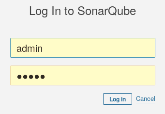
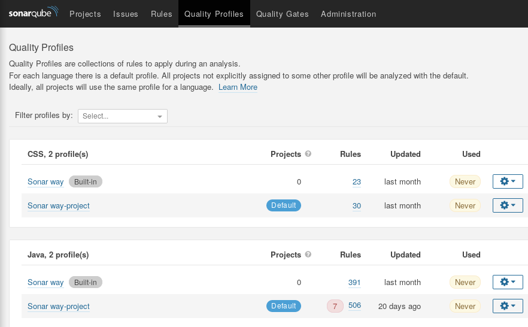
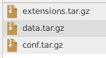
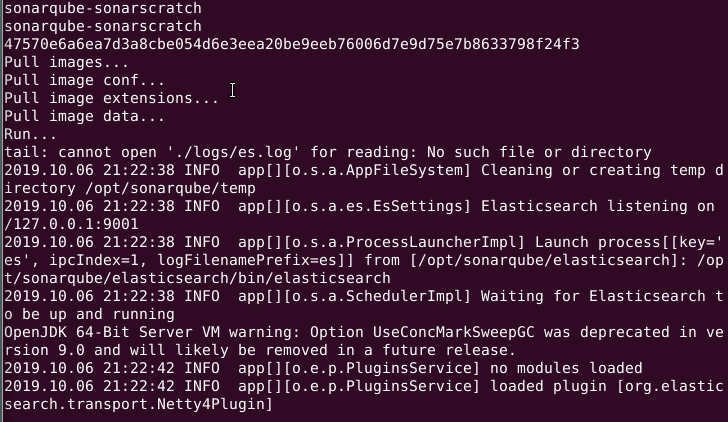
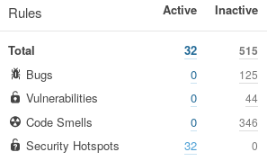

# How SONARSCRATCH works

You start a new project. This project uses for example the language **Java**.
You decide to control the quality of your *Java* code using **SonarQube**.
It's possible to install [SonarQube as server](https://docs.sonarqube.org/latest/setup/install-server).
You find that's complicated (Java installation, data base installation...), you decide to use the available [docker image](https://hub.docker.com/_/sonarqube) because it's provide a fully *SonarQube* server ready to use. You install **docker** and you pull the image :

```bash
docker pull sonarqube
```

After pulling *SonarQube* image, you run a container and you start analyzing your project.

Because you are very careful with code quality, you put theses rules :

1. All available rules for language *Java* are used.

1. No rule should be violated (0 issues).

You run your first analysis and you fix all issues. Your project code is clean, you want to share
it with another developer (as open source project for example). This developer add some features
and fix all found issues. He send to you his work and you decide to check if there is an issue in
*SonarQube*. Oups, you found some issues, you respond your friend : are you analyze the code using
*SonarQube* ? He respond : of course. So why I found theses issues ?

The response is your *SonarQube* configuration is different from the other developer, because you are
decided to use all rules while you friend use standard rules. The solution : **SONARSCRATCH**.

After installing *SONARSCRATCH*, you must configure your *SonarQube* for your project.
So run this command :

```bash
sn-scratch factory
```

If the docker command needs to be run as **root**, flow the steps in this [link](https://docs.docker.com/install/linux/linux-postinstall) (section **Manage Docker as a non-root user**). Otherwise you must
run the previous command as root using **sudo**.

Once the application started (can take time), login as administrator using default login `admin` and default password `admin`.



Now you can set your custom rules using **Quality Profiles** section.



Once your configuration (rules, default profile...) is well tested. Stop running *SonarQube* container using
this command :

```bash
sn-scratch stop
```

Run this command to push this configuration and use it everywhere :

```bash
sn-scratch push ROOT
```

where **ROOT** is your root directory for your configuration. If the command succeed,
you must have three files in a directory named **default** in the *ROOT* directory :



Now, you have a configuration for your project, to use it at any moment, execute this command

```bash
sn-scratch new ROOT
```

By design any execution of this last command show you the same *SonarQube* state. So if you mark
an issue as resolved, you can't see that in the next run. So if you want no issue violated, you must
resolve it in your code or remove the rule from your configuration.

In some cases, you want to launch a new *SonarQube* instance in **debug** mode. This can be
helpful to understand some problems, so execute the same command with `--debug` option :

```bash
sn-scratch new ROOT --debug
```

You should have *SonarQube* log like this :



You can use the combination of  `Ctrl` + `C` to stop *SonarQube* container.

Trying to fix all issues, you found some particular issues, the **Hotspot** issues. These issues
can not resolved by changing code, because they are not a true issues but an indication (spot)
of possible security threat. If you mark these issues as resolved, the next time you run your configuration
they reappear. The solution is to remove these *Hotspot* rules from configuration and create another one
contains only these rules. In this manner, you isolate this kind of issues.

To create a new different configuration, you must use configuration naming. So run the default or the factory configuration. Reset profiles and add *Hotspot* rules :



Stop SonarQube container (using `sn-scratch stop`) and push the configuration by executing this command :

```bash
sn-scratch push ROOT NAME
```

where **NAME** is the configuration name (for example *hotspot*). To run SonarQube in this configuration, use this command :

```bash
sn-scratch new ROOT NAME
```

If you have a small configuration (*RAM*), your computer can freeze. To avoid this, you must launch *SonarQube* with memory limitation. The option `--limit` is the solution, so execute this command (with **850 Mb** as memory limit) :

```bash
sn-scratch new ROOT [NAME] --limit 850m
```

**SonarSource** (the company behind *SonarQube*) release new version, you want to test it.
You launch *sn-scratch* and you find that's not works. Don't panic, execute *sn-scratch* using the latest working *SonarQube* image using this command (with version 7.9 instead 8.0) :

```bash
sn-scratch new ROOT [NAME] --name sonarqube:7.9-community
```